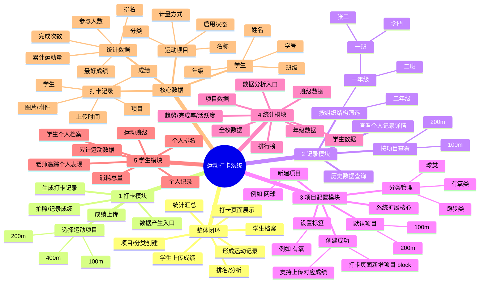

# 运动打卡系统功能结构思维导图

```mermaid
mindmap
  root((运动打卡系统))
    整体闭环
      项目/分类创建
      打卡页面展示
      学生上传成绩
      形成运动记录
      统计汇总
      学生档案
      排名/分析
    1 打卡模块
      数据产生入口
      选择运动项目
        100m
        200m
        400m
      拍照/记录成绩
      成绩上传
      生成打卡记录
    2 记录模块
      历史数据查询
      按项目查看
        100m
        200m
      按组织结构筛选
        一年级
          一班
            张三
            李四
          二班
        二年级
      查看个人记录详情
    3 项目配置模块
      系统扩展核心
      分类管理
        跑步类
        球类
        有氧类
      默认项目
        100m
        200m
      新建项目
        例如 网球
      设置标签
        例如 有氧
      创建成功
        打卡页面新增项目 block
        支持上传对应成绩
    4 统计模块
      数据分析入口
      全校数据
      年级数据
      班级数据
      项目数据
      学生数据
      排行榜
      趋势/完成率/活跃度
    5 学生模块
      学生个人档案
      运动班级
      个人记录
      个人排名
      消耗总量
      累计运动数据
      老师追踪个人表现
    核心数据
      运动项目
        名称
        分类
        启用状态
        计量方式
      学生
        姓名
        年级
        班级
        学号
      打卡记录
        学生
        项目
        成绩
        图片/附件
        上传时间
      统计数据
        参与人数
        完成次数
        最好成绩
        累计运动量
        排名
```

## 一句话理解

这个系统以“项目配置”为起点，以“学生打卡上传”为核心，把运动数据沉淀成记录、统计、排名和学生个人档案。
