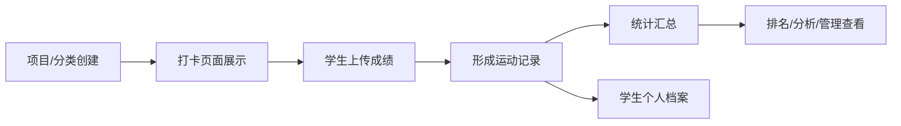
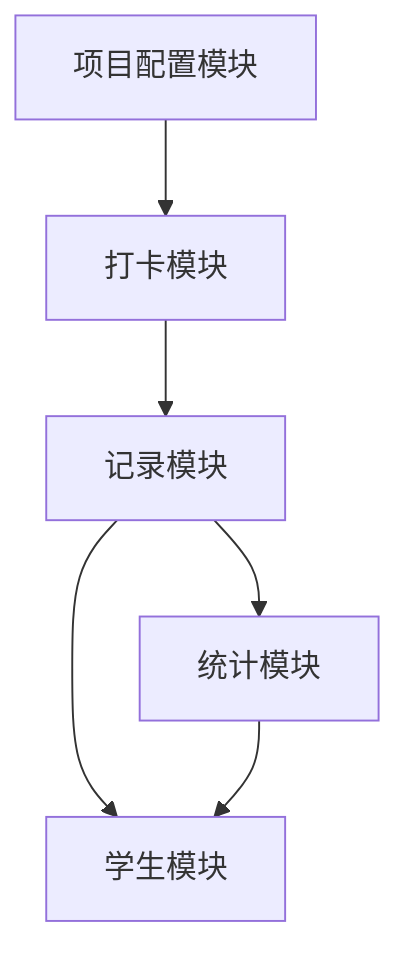

# 运动打卡系统功能结构设计说明

## 1. 整体设计思路

这个系统的核心不是单纯记录运动成绩，而是围绕“运动项目配置、学生打卡、记录沉淀、数据统计、学生档案”形成一个完整闭环。

整体链路可以理解为：



也就是说，管理员或老师先配置运动项目，学生再基于这些项目进行打卡上传，系统保存记录，并进一步生成统计数据、排名数据和学生个人运动档案。

## 2. 五个核心模块

### 2.1 打卡模块

打卡模块是数据产生入口。

主要功能：

- 展示可打卡的运动项目，例如 `100m`、`200m`、`400m`
- 进入具体项目后支持拍照、记录成绩或上传结果
- 将学生的运动成绩上传到系统
- 上传成功后形成一条运动记录

示例流程：

```text
选择 100m
-> 拍照 / 录入成绩
-> 成绩上传
-> 生成记录
```

这个模块负责解决“数据从哪里来”的问题。

### 2.2 记录模块

记录模块是历史数据查询入口。

主要功能：

- 按运动项目查看记录，例如 `100m`、`200m`
- 按组织结构筛选数据，例如年级、班级、学生
- 支持从整体逐层下钻到具体学生

层级结构示例：

```text
记录
├── 100m
├── 200m
└── 年级
    ├── 一年级
    │   ├── 一班
    │   │   ├── 张三
    │   │   └── 李四
    │   └── 二班
    └── 二年级
```

这个模块负责解决“已经上传的数据怎么查”的问题。

### 2.3 签到 / 项目配置模块

这个模块更准确地说，是运动项目和分类的配置中心。

主要功能：

- 管理项目分类，例如跑步类、球类、有氧类
- 默认支持已有项目，例如 `100m`、`200m`
- 支持新建项目，例如“网球”
- 给项目设置标签或分类，例如“有氧”
- 创建成功后，自动在打卡页面新增对应的打卡入口

示例流程：

```text
新建项目：网球
-> 设置分类 / 标签：有氧
-> 创建成功
-> 打卡页面出现“网球”打卡 block
-> 学生可上传网球成绩或记录
```

这个模块是整个系统可扩展性的关键。  
因为只要项目配置做得灵活，系统就不会被限制在 `100m`、`200m` 这类固定项目上，后续可以扩展到跳绳、篮球、网球、体测等更多运动类型。

### 2.4 统计模块

统计模块是数据分析和管理查看入口。

主要功能：

- 汇总全校运动数据
- 按年级统计数据
- 按班级统计数据
- 支持项目维度、学生维度的数据分析
- 可进一步扩展排行榜、趋势图、完成率、活跃度等内容

统计层级示例：

```text
统计数据
-> 全校数据
-> 全年级数据
-> 分班级
-> 分学生 / 分项目
```

这个模块负责解决“数据上传之后有什么价值”的问题。

### 2.5 学生模块

学生模块是学生个人维度的数据入口。

主要功能：

- 查看学生所属运动班级
- 查看学生个人运动记录
- 查看学生排名
- 查看消耗量、积分或累计运动数据
- 支持老师从学生维度追踪个人表现

结构示例：

```text
学生
├── 运动班级
├── 记录
├── 排名
└── 消耗总量
```

这个模块负责解决“每个学生自己的运动情况如何沉淀”的问题。

## 3. 模块之间的关系

五个模块之间不是孤立的，而是互相连接：



关系说明：

- 项目配置模块决定打卡模块里有哪些运动项目
- 打卡模块负责产生运动数据
- 记录模块负责保存和查询运动数据
- 统计模块基于记录做汇总分析
- 学生模块基于记录和统计展示个人结果

## 4. 数据模型理解

从功能结构来看，系统里至少需要以下几类核心数据：

### 4.1 运动项目

用于描述可以打卡的运动内容。

字段示例：

```text
项目名称：100m / 200m / 网球
项目分类：跑步 / 球类 / 有氧
是否启用：是 / 否
计量方式：时间 / 次数 / 分数 / 图片记录
```

### 4.2 学生

用于描述学生身份和组织关系。

字段示例：

```text
姓名
年级
班级
运动班级
学号
```

### 4.3 打卡记录

用于保存每一次上传结果。

字段示例：

```text
学生
运动项目
成绩
图片 / 附件
上传时间
审核状态
```

### 4.4 统计数据

统计数据可以由打卡记录计算生成。

字段示例：

```text
全校参与人数
年级参与人数
班级完成次数
项目完成次数
个人最好成绩
个人累计运动量
排名
```

## 5. 推荐页面结构

根据你的草图，可以初步拆成以下页面：

```text
首页 / 总览
├── 打卡
│   ├── 项目列表
│   └── 成绩上传
├── 记录
│   ├── 项目记录
│   ├── 年级记录
│   ├── 班级记录
│   └── 学生记录详情
├── 项目管理
│   ├── 分类管理
│   ├── 项目新建
│   └── 项目启用 / 停用
├── 统计
│   ├── 全校统计
│   ├── 年级统计
│   ├── 班级统计
│   └── 排行榜
└── 学生
    ├── 学生列表
    ├── 学生档案
    ├── 学生记录
    └── 学生排名
```

## 6. 设计亮点

这个设计最大的亮点是“项目可配置”。

如果运动项目是写死的，系统只能做固定项目，比如 `100m`、`200m`。  
但如果项目可以新建、分类、启用，并自动出现在打卡页面，那么整个系统就具备了扩展能力。

后续无论新增：

- 跑步项目
- 球类项目
- 跳绳项目
- 体测项目
- 课堂运动项目
- 课后训练项目

都可以复用同一套打卡、记录、统计和学生档案逻辑。

## 7. 一句话总结

这是一个以“运动项目配置”为起点，以“学生打卡上传”为核心，以“记录、统计、排名、学生档案”为结果的运动数据管理系统。
